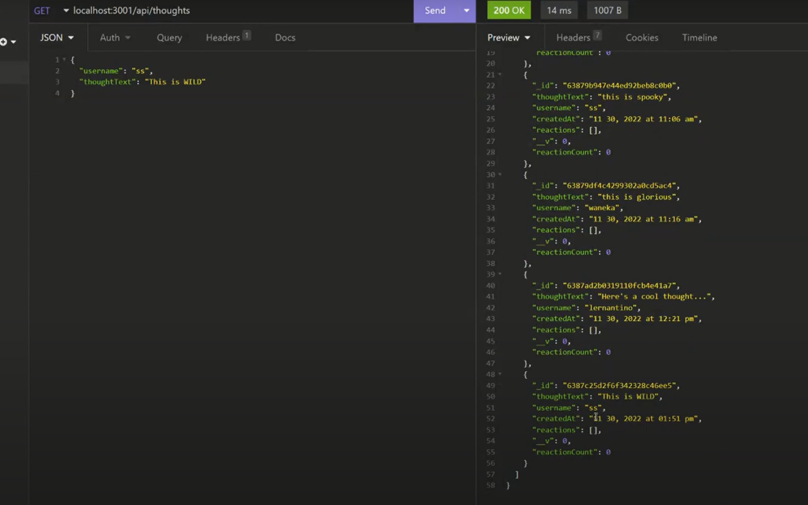

# Social_Network_API_NoSQL
Uses Express.js, MongoDB, and Mongoose ODM

# User Story
AS A social media startup
I WANT an API for my social network that uses a NoSQL database
SO THAT my website can handle large amounts of unstructured data.

## Table of Contents
  * [Description](#description)
  * [Usage](#usefaq)
  * [Installation](#install)
  * [Run](#run)
  * [Dependencies](#dependencies)
  * [Technology Used](#techno)
  * [Demo](#demo)
  * [Testing](#test)
  * [License](#license)
  * [Contributing to this Repo](#contributing)
  * [Questions / Contact Details](#questions)

  
  ## Description
  This application is an API for a social network web application where users can share their thoughts, react to friends’ thoughts, and create a friend list.

  
  ## Usage
  This is a back end application to connet to a NoSQL (MongoDB) database.  It uses Insomnia to view the CRUD operations in the database.

  
  ## Installation   
    Please use npm 
  * npm i - to install all files and dependencies OR

  * npm init to create a json file,  
  * npm i mongoose 
  * npm i express 
  * npm i moment

  
  ## Run
  npm start

  
  ## Dependencies
    * "express": "^4.18.2",
    * "moment": "^2.29.4",
    * "mongoose": "^6.7.4"
  
  
  ## Technologies Used
  * Javascript
  * Node.js
  * Express.js
  * Moment.js
  * MongoDB 
  * Mongoose ODM
  * Insomnia

  
  ## Demo
  

  To watch the application in action, click [here](https://www.youtube.com/watch?v=EtIOesZm-bM)

  
  ## License
  The application is covered under a MIT license.

  
  ## Contributing to this Repo
  Please [email](smilligan0183@gmail.com) me if you'd like to contribute

  
  ## Questions / Contact Details
  This app can be found on my github page at [Sara-Mill](https://github.com/Sara-Mill).
  

  If you have any questions or need to contact me about this app, I can be reached on [Github](https://github.com/Sara-Mill) or by [email](smilligan0183@gmail.com)